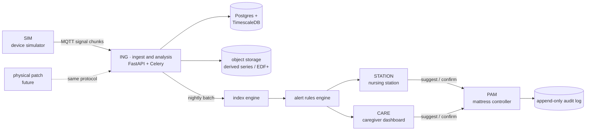

# Architecture



## Technology

| Layer | Choice | Why |
|---|---|---|
| Signal processing, backend | Python 3.12 + FastAPI | scipy/numpy ecosystem; the ML path in v2 lands in the same process |
| Async work | Celery + Redis | overnight batch analysis, with retries and a dead-letter path |
| Database | PostgreSQL 16 + TimescaleDB | hypertable for the one-row-per-second signal summary |
| Object storage | MinIO / S3 | derived series, optional raw, EDF+ exports |
| Transport | MQTT (Mosquitto) | matches how a real patch would publish |
| Frontend | React 18 + TypeScript + Vite + Tailwind + Recharts | as specified |
| Containers | Docker Compose | one `docker compose up` |

## Decisions worth knowing about

### Everything runs without infrastructure

`DATABASE_URL` defaults to SQLite and object storage falls back to the local
filesystem, so `make demo` and the whole test suite run with no database,
broker, cache or object store. Compose supplies the production-shaped versions
of all four. The same code paths run in both; nothing is stubbed for tests.

### Schemas are the single source of truth

`packages/shared-schemas/schemas/*.json` generates both the Pydantic models and
the TypeScript types. No type is hand-written in either language. Generated
output is committed so nothing at build time depends on the generator running,
and CI re-runs `make schemas` and fails on drift.

The generator is a ~300-line script in this repo rather than
`datamodel-code-generator` and `json-schema-to-typescript`, which the PRD names.
Both would have put a network-installed toolchain on the critical path of every
build, and the TypeScript one drags in a full npm dependency tree to emit four
hundred lines. Swapping back changes exactly one file.

### Stage 1 during ingest, everything else at close

Only preprocessing runs as chunks arrive, and it makes no decisions — it reduces
1.4 GB of waveform to about 100 MB of derived series. All detection, feature and
alert logic runs in a batch task after the session closes, which is what keeps
the system off any real-time path (see [regulatory.md](regulatory.md)).

### Idempotent analysis

Re-running `analyze(session_id)` reads the stored derived series and replaces
its results wholesale, producing identical output for the same
`algorithm_version`. Alerts are an exception: an open alert is *superseded*
rather than deleted, because an alert somebody already acted on is part of the
record. `test_analysis_is_idempotent` covers this.

### Two dashboards, one shared source tree

`packages/web-shared` holds the API client, i18n dictionary, formatting, charts
and the research-use footer. Both apps consume it through a Vite/TypeScript path
alias inside an npm workspace, so there are no publish steps and no duplicated
types.

### PAM shares the data layer

`somno_pam` depends on `somno_ing` for the database session and the audit log.
The alternative — a second schema and a second append-only log — would have made
the tamper-evident chain span two stores, which is worse than the coupling.

## Data model

```
Subject          pseudonymous code only, never a name or identifier
Device           patch, with battery / storage / electrode telemetry
Bed              ward position, optionally with a PAM
Session          one overnight recording
SignalSummary    one row per second (Timescale hypertable)
SleepEpoch       30 s staging, imported from PSG or SIM
ArousalEvent     micro-arousals
SwallowEvent     the core entity: detected, ground_truth or manual_annotation
PostureSegment   derived from the gravity vector
NightlyRisk      four weighted components, or insufficient_data
Alert            severity, actions, dedup key, delivery time
CareAction       what was actually done
MattressCommand  what PAM was asked to do, by whom, and what happened
AuditLog         append-only, hash-chained
```

`SwallowEvent.source` is what makes evaluation possible: ground truth and
detected events live in the same table with the same shape, so
`/v1/eval/detection` is a query rather than a special case.
